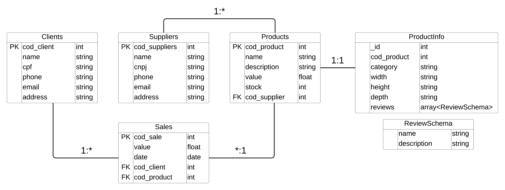

# Store API

A Store API permite o gerenciamento de uma plataforma de vendas que controla as informações dos clientes, produtos, fornecedores e vendas.

## Modelo Relacional da API

-   A tabela Clients possui dados dos clientes
-   A tabela Suppliers possui dados dos fornecedores dos produtos
-   A tabela Products possui dados dos produtos
-   A tabela Sales possui dados das vendas dos produtos e dos clientes que fizeram a compra
-   A tabela ProductInfo possui informações dos produtos (MongoDB)



## 🚀 Tecnologias Utilizadas

-   **`express`**  
    É um framework para Node.js utilizado para facilitar a criação da API

-   **`cors`**  
    Utilizado para controlar quais páginas web podem fazer requisições para a API

-   **`winston`**  
    Utilizado para gerenciar e personalizar o log da API

-   **`mongodb`**  
    É uma biblioteca utilizada para permitir a interação com o banco de dados MongoDB

-   **`mongoose`**
    O Mongoose é uma biblioteca utilizada para modelar os documentos do banco de dados MongoDB de uma forma mais estruturada e organizada

-   **`sequelize`**
    O Sequelize é uma ORM utilizado para interagir com o bancos de dados relacional MySQL

-   **`mysql2`**
    O MySQL2 é uma biblioteca utilizada para permitir a interação com bancos de dados MySQL

## 🛠️ Como executar o projeto

1. Instale as dependências do projeto

    ```sh
    npm install
    ```

2. Criação das variáveis de ambiente

    1. Crie um arquivo chamado `.env` na raiz do projeto
    2. Declare as variávis de ambiente

        ```
        DB_USERNAME = "usuário"
        DB_PASSWORD = "senha"
        DB_SERVER = "servidor-banco"
        DB_DATABASE = "nome-banco"

        MONGODB_CONNECTION_STRING = "string de conexão do mongoDB"
        ```

3. Inicie o projeto Localmente

    ```sh
    npm run start
    ```

4. Execute o endpoint `http://localhost:3000/database/create` para gerar as tabelas no banco de dados

## 🔛 Como consultar os endpoints

### Clientes

<details>
  <summary>POST /client - Endpoint responsável por criar um novo cliente</summary>

#### **Parâmetros da Requisição**

| **Tipo** | **Parâmetro** | **Descrição**       | **Obrigatório** |
| -------- | ------------- | ------------------- | --------------- |
| body     | `name`        | Nome do cliente     | Sim             |
| body     | `cpf`         | CPF do cliente      | Sim             |
| body     | `phone`       | Telefone do cliente | Sim             |
| body     | `email`       | Email do cliente    | Sim             |
| body     | `address`     | Endereço do cliente | Sim             |

#### **Respostas da Requisição**

| **Código** | **Status**  | **Descrição**                        |
| ---------- | ----------- | ------------------------------------ |
| 201        | Created     | O cliente foi cadastrado com sucesso |
| 400        | Bad Request | Houve um erro ao cadastrar o cliente |

#### **Resposta 201 do endoint**

```json
{
    "cod_client": 1,
    "name": "Julia Bruna Fogaça",
    "cpf": "65324042846",
    "phone": "11997068830",
    "email": "julia_bruna_fogaca@gmail.com",
    "address": "Rua Rita N°602 - Jardim Roberto - Osasco - SP",
    "updatedAt": "2024-11-30T00:45:56.663Z",
    "createdAt": "2024-11-30T00:45:56.663Z"
}
```

</details>

<details>
  <summary>GET /client - Endpoint responsável por listar todos os clientes</summary>

#### **Respostas da Requisição**

| **Código** | **Status**  | **Descrição**                          |
| ---------- | ----------- | -------------------------------------- |
| 200        | Ok          | Os clientes foram listados com sucesso |
| 400        | Bad Request | Houve um erro ao listar os clientes    |

#### **Resposta 200 do endoint**

```json
[
    {
        "cod_client": 1,
        "name": "Julia Bruna Fogaça",
        "cpf": "65324042846",
        "phone": "11997068830",
        "email": "julia_bruna_fogaca@gmail.com",
        "address": "Rua Rita N°602 - Jardim Roberto - Osasco - SP",
        "createdAt": "2024-11-30T00:45:56.000Z",
        "updatedAt": "2024-11-30T00:45:56.000Z"
    },
    {
        "cod_client": 2,
        "name": "Bárbara Sarah Andreia Moreira",
        "cpf": "28613492800",
        "phone": "11997604475",
        "email": "barbara.sarah.moreira@gmail.com.br",
        "address": "Avenida Sete de Setembro N°475 - Cipava - Osasco - SP",
        "createdAt": "2024-11-30T00:56:46.000Z",
        "updatedAt": "2024-11-30T00:56:46.000Z"
    }
]
```

</details>

<details>
  <summary>GET /client/:cod_client - Endpoint responsável por obter um cliente</summary>

#### **Parâmetros da Requisição**

| **Tipo**          | **Parâmetro** | **Descrição**     | **Obrigatório** |
| ----------------- | ------------- | ----------------- | --------------- |
| parâmetro de rota | `cod_client`  | Código do cliente | Sim             |

#### **Respostas da Requisição**

| **Código** | **Status**  | **Descrição**                    |
| ---------- | ----------- | -------------------------------- |
| 200        | Ok          | O cliente foi obtido com sucesso |
| 400        | Bad Request | Houve um erro ao obter o cliente |

#### **Resposta 200 do endoint**

```json
{
    "cod_client": 1,
    "name": "Julia Bruna Fogaça",
    "cpf": "65324042846",
    "phone": "11997068830",
    "email": "julia_bruna_fogaca@gmail.com",
    "address": "Rua Rita N°602 - Jardim Roberto - Osasco - SP",
    "createdAt": "2024-11-30T00:45:56.000Z",
    "updatedAt": "2024-11-30T00:45:56.000Z"
}
```

</details>

<details>
  <summary>PATCH /client - Endpoint responsável por atualizar um cliente</summary>

#### **Parâmetros da Requisição**

| **Tipo** | **Parâmetro** | **Descrição**       | **Obrigatório** |
| -------- | ------------- | ------------------- | --------------- |
| body     | `cod_client`  | Código do cliente   | Sim             |
| body     | `name`        | Nome do cliente     | Não             |
| body     | `cpf`         | CPF do cliente      | Não             |
| body     | `phone`       | Telefone do cliente | Não             |
| body     | `email`       | Email do cliente    | Não             |
| body     | `address`     | Endereço do cliente | Não             |

#### **Respostas da Requisição**

| **Código** | **Status**  | **Descrição**                        |
| ---------- | ----------- | ------------------------------------ |
| 200        | Ok          | O cliente foi atualizado com sucesso |
| 400        | Bad Request | Houve um erro ao atualizar o cliente |

#### **Resposta 200 do endoint**

```json
{
    "cod_client": 2,
    "name": "Bárbara Sarah Andreia Moreira",
    "cpf": "28613492800",
    "phone": "11997604475",
    "email": "barbara.sarah.moreira@gmail.com.br",
    "address": "Avenida Sete de Setembro N°476 - Cipava - Osasco - SP",
    "createdAt": "2024-11-30T00:56:46.000Z",
    "updatedAt": "2024-11-30T01:03:27.000Z"
}
```

</details>

### Fornecedores

<details>
  <summary>POST /supplier - Endpoint responsável por criar um novo fornecedor</summary>

#### **Parâmetros da Requisição**

| **Tipo** | **Parâmetro** | **Descrição**          | **Obrigatório** |
| -------- | ------------- | ---------------------- | --------------- |
| body     | `name`        | Nome do fornecedor     | Sim             |
| body     | `cnpj`        | CNPJ do fornecedor     | Sim             |
| body     | `phone`       | Telefone do fornecedor | Sim             |
| body     | `email`       | Email do fornecedor    | Sim             |
| body     | `address`     | Endereço do fornecedor | Sim             |

#### **Respostas da Requisição**

| **Código** | **Status**  | **Descrição**                           |
| ---------- | ----------- | --------------------------------------- |
| 201        | Created     | O fornecedor foi cadastrado com sucesso |
| 400        | Bad Request | Houve um erro ao cadastrar o fornecedor |

#### **Resposta 201 do endoint**

```json
{
    "cod_supplier": 1,
    "name": "Paulo e Eduarda Construções ME",
    "cnpj": "21824019000122",
    "phone": "11996860876",
    "email": "pauloeduardaconstrucoesme@gmail.com.br",
    "address": "Rua Alzira N°149 - São Bernardo do Campo - Independência - SP",
    "updatedAt": "2024-11-30T18:58:53.558Z",
    "createdAt": "2024-11-30T18:58:53.558Z"
}
```

</details>

<details>
  <summary>GET /supplier - Endpoint responsável por listar todos os fornecedores</summary>

#### **Respostas da Requisição**

| **Código** | **Status**  | **Descrição**                              |
| ---------- | ----------- | ------------------------------------------ |
| 200        | Ok          | Os fornecedores foram listados com sucesso |
| 400        | Bad Request | Houve um erro ao listar os fornecedores    |

#### **Resposta 200 do endoint**

```json
[
    {
        "cod_supplier": 1,
        "name": "Paulo e Eduarda Construções ME",
        "cnpj": "21824019000122",
        "phone": "11996860876",
        "email": "pauloeduardaconstrucoesme@gmail.com.br",
        "address": "Rua Alzira N°149 - São Bernardo do Campo - Independência - SP",
        "createdAt": "2024-11-30T18:58:53.000Z",
        "updatedAt": "2024-11-30T18:58:53.000Z"
    },
    {
        "cod_supplier": 2,
        "name": "Ricardo e Severino Marcenaria",
        "cnpj": "05358813000171",
        "phone": "11983958341",
        "email": "ricardoeseverinomarcenaria@gmail.com.br",
        "address": "Avenida Presidente Castelo Branco N°628 - Mauá - Jardim Zaira - SP",
        "createdAt": "2024-11-30T19:01:42.000Z",
        "updatedAt": "2024-11-30T19:01:42.000Z"
    }
]
```

</details>

<details>
  <summary>GET /supplier/:cod_supplier - Endpoint responsável por obter um fornecedor</summary>

#### **Parâmetros da Requisição**

| **Tipo**          | **Parâmetro**  | **Descrição**        | **Obrigatório** |
| ----------------- | -------------- | -------------------- | --------------- |
| parâmetro de rota | `cod_supplier` | Código do fornecedor | Sim             |

#### **Respostas da Requisição**

| **Código** | **Status**  | **Descrição**                       |
| ---------- | ----------- | ----------------------------------- |
| 200        | Ok          | O fornecedor foi obtido com sucesso |
| 400        | Bad Request | Houve um erro ao obter o fornecedor |

#### **Resposta 200 do endoint**

```json
{
    "cod_supplier": 1,
    "name": "Paulo e Eduarda Construções ME",
    "cnpj": "21824019000122",
    "phone": "11996860876",
    "email": "pauloeduardaconstrucoesme@gmail.com.br",
    "address": "Rua Alzira N°149 - São Bernardo do Campo - Independência - SP",
    "createdAt": "2024-11-30T18:58:53.000Z",
    "updatedAt": "2024-11-30T18:58:53.000Z"
}
```

</details>

<details>
  <summary>PATCH /supplier - Endpoint responsável por atualizar um fornecedor</summary>

#### **Parâmetros da Requisição**

| **Tipo** | **Parâmetro**  | **Descrição**          | **Obrigatório** |
| -------- | -------------- | ---------------------- | --------------- |
| body     | `cod_supplier` | Código do fornecedor   | Sim             |
| body     | `name`         | Nome do fornecedor     | Não             |
| body     | `cnpj`         | CNPJ do fornecedor     | Não             |
| body     | `phone`        | Telefone do fornecedor | Não             |
| body     | `email`        | Email do fornecedor    | Não             |
| body     | `address`      | Endereço do fornecedor | Não             |

#### **Respostas da Requisição**

| **Código** | **Status**  | **Descrição**                           |
| ---------- | ----------- | --------------------------------------- |
| 200        | Ok          | O fornecedor foi atualizado com sucesso |
| 400        | Bad Request | Houve um erro ao atualizar o fornecedor |

#### **Resposta 200 do endoint**

```json
{
    "cod_supplier": 1,
    "name": "Paulo e Eduarda Construções ME",
    "cnpj": "21824019000122",
    "phone": "11996860876",
    "email": "pauloeduardaconstrucoesme@gmail.com.br",
    "address": "Rua Alzira N°147 - São Bernardo do Campo - Independência - SP",
    "createdAt": "2024-11-30T18:58:53.000Z",
    "updatedAt": "2024-11-30T18:58:53.000Z"
}
```

</details>

### Produtos

<details>
  <summary>POST /product - Endpoint responsável por criar um novo produto</summary>

#### **Parâmetros da Requisição**

| **Tipo** | **Parâmetro**  | **Descrição**                    | **Obrigatório** |
| -------- | -------------- | -------------------------------- | --------------- |
| body     | `name`         | Nome do produto                  | Sim             |
| body     | `description`  | Descrição do produto             | Sim             |
| body     | `value`        | Valor do produto                 | Sim             |
| body     | `stock`        | Quantidade em Estoque do produto | Sim             |
| body     | `cod_supplier` | Código do fornecedor             | Sim             |

#### **Respostas da Requisição**

| **Código** | **Status**  | **Descrição**                        |
| ---------- | ----------- | ------------------------------------ |
| 201        | Created     | O produto foi cadastrado com sucesso |
| 400        | Bad Request | Houve um erro ao cadastrar o produto |

#### **Resposta 201 do endoint**

```json
{
    "cod_product": 1,
    "name": "Smartphone Samsung Galaxy S23",
    "description": "Smartphone Samsung Galaxy S23 256GB Preto 5G 8GB RAM 6,1” Câm Tripla + Selfie 12MP",
    "value": 2799,
    "stock": 2,
    "cod_supplier": 1,
    "updatedAt": "2024-11-30T19:17:42.041Z",
    "createdAt": "2024-11-30T19:17:42.041Z"
}
```

</details>

<details>
  <summary>GET /product - Endpoint responsável por listar todos os produtos</summary>

#### **Respostas da Requisição**

| **Código** | **Status**  | **Descrição**                          |
| ---------- | ----------- | -------------------------------------- |
| 200        | Ok          | Os produtos foram listados com sucesso |
| 400        | Bad Request | Houve um erro ao listar os produtos    |

#### **Resposta 200 do endoint**

```json
[
    {
        "cod_product": 1,
        "name": "Smartphone Samsung Galaxy S23",
        "description": "Smartphone Samsung Galaxy S23 256GB Preto 5G 8GB RAM 6,1” Câm Tripla + Selfie 12MP",
        "value": 2799,
        "stock": 2,
        "createdAt": "2024-11-30T19:17:42.000Z",
        "updatedAt": "2024-11-30T19:17:42.000Z",
        "cod_supplier": 1
    },
    {
        "cod_product": 2,
        "name": "Monitor Gamer AOC 23,8",
        "description": "Monitor Gamer AOC 23,8 Full HD HDMI 165Hz 1ms 24G2S/BK com Ajuste de Altura",
        "value": 656.1,
        "stock": 3,
        "createdAt": "2024-11-30T19:27:03.000Z",
        "updatedAt": "2024-11-30T19:27:03.000Z",
        "cod_supplier": 1
    }
]
```

</details>

<details>
  <summary>GET /product/:cod_product - Endpoint responsável por obter um produto</summary>

#### **Parâmetros da Requisição**

| **Tipo**          | **Parâmetro** | **Descrição**     | **Obrigatório** |
| ----------------- | ------------- | ----------------- | --------------- |
| parâmetro de rota | `cod_product` | Código do produto | Sim             |

#### **Respostas da Requisição**

| **Código** | **Status**  | **Descrição**                    |
| ---------- | ----------- | -------------------------------- |
| 200        | Ok          | O produto foi obtido com sucesso |
| 400        | Bad Request | Houve um erro ao obter o produto |

#### **Resposta 200 do endoint**

```json
{
    "cod_product": 1,
    "name": "Smartphone Samsung Galaxy S23",
    "description": "Smartphone Samsung Galaxy S23 256GB Preto 5G 8GB RAM 6,1” Câm Tripla + Selfie 12MP",
    "value": 2799,
    "stock": 2,
    "createdAt": "2024-11-30T19:17:42.000Z",
    "updatedAt": "2024-11-30T19:17:42.000Z",
    "cod_supplier": 1
}
```

</details>

<details>
  <summary>PATCH /product - Endpoint responsável por atualizar um produto</summary>

#### **Parâmetros da Requisição**

| **Tipo** | **Parâmetro**  | **Descrição**                    | **Obrigatório** |
| -------- | -------------- | -------------------------------- | --------------- |
| body     | `cod_product`  | Código do produto                | Sim             |
| body     | `name`         | Nome do produto                  | Não             |
| body     | `description`  | Descrição do produto             | Não             |
| body     | `value`        | Valor do produto                 | Não             |
| body     | `stock`        | Quantidade em Estoque do produto | Não             |
| body     | `cod_supplier` | Código do fornecedor             | Não             |

#### **Respostas da Requisição**

| **Código** | **Status**  | **Descrição**                        |
| ---------- | ----------- | ------------------------------------ |
| 200        | Ok          | O produto foi atualizado com sucesso |
| 400        | Bad Request | Houve um erro ao atualizar o produto |

#### **Resposta 200 do endoint**

```json
{
    "cod_product": 1,
    "name": "Smartphone Samsung Galaxy S23",
    "description": "Smartphone Samsung Galaxy S23 256GB Preto 5G 8GB RAM 6,1” Câm Tripla + Selfie 12MP",
    "value": 2699,
    "stock": 2,
    "createdAt": "2024-11-30T19:17:42.000Z",
    "updatedAt": "2024-11-30T19:31:19.000Z",
    "cod_supplier": 1
}
```

</details>

### Vendas

<details>
  <summary>POST /sale - Endpoint responsável por registrar uma nova venda</summary>

#### **Parâmetros da Requisição**

| **Tipo** | **Parâmetro** | **Descrição**     | **Obrigatório** |
| -------- | ------------- | ----------------- | --------------- |
| body     | `cod_client`  | Código do cliente | Sim             |
| body     | `cod_product` | Código do produto | Sim             |

#### **Respostas da Requisição**

| **Código** | **Status**  | **Descrição**                      |
| ---------- | ----------- | ---------------------------------- |
| 201        | Created     | A venda foi cadastrada com sucesso |
| 400        | Bad Request | Houve um erro ao registrar a venda |

#### **Resposta 201 do endoint**

```json
{
    "cod_sale": 1,
    "cod_client": 1,
    "cod_product": 1,
    "value": 2799,
    "date": "2024-11-30T22:16:33.777Z",
    "updatedAt": "2024-11-30T22:16:33.778Z",
    "createdAt": "2024-11-30T22:16:33.778Z"
}
```

</details>

<details>
  <summary>GET /sale - Endpoint responsável por listar todas as vendas com as informações do cliente e produto</summary>

#### **Respostas da Requisição**

| **Código** | **Status**  | **Descrição**                        |
| ---------- | ----------- | ------------------------------------ |
| 200        | Ok          | As vendas foram listadas com sucesso |
| 400        | Bad Request | Houve um erro ao listar as vendas    |

#### **Resposta 200 do endoint**

```json
[
    {
        "cod_sale": 1,
        "value": 2799,
        "date": "2024-11-30T22:16:33.000Z",
        "createdAt": "2024-11-30T22:16:33.000Z",
        "updatedAt": "2024-11-30T22:16:33.000Z",
        "cod_client": 1,
        "cod_product": 1,
        "client": {
            "cod_client": 1,
            "name": "Bárbara Sarah Andreia Moreira",
            "cpf": "28613492800",
            "phone": "11997604475",
            "email": "barbara.sarah.moreira@gmail.com.br",
            "address": "Avenida Sete de Setembro N°475 - Cipava - Osasco - SP",
            "createdAt": "2024-11-30T22:15:40.000Z",
            "updatedAt": "2024-11-30T22:15:40.000Z"
        },
        "product": {
            "cod_product": 1,
            "name": "Smartphone Samsung Galaxy S23",
            "description": "Smartphone Samsung Galaxy S23 256GB Preto 5G 8GB RAM 6,1” Câm Tripla + Selfie 12MP",
            "value": 2799,
            "stock": 1,
            "createdAt": "2024-11-30T22:16:16.000Z",
            "updatedAt": "2024-11-30T22:16:41.000Z",
            "cod_supplier": 1
        }
    },
    {
        "cod_sale": 2,
        "value": 656.1,
        "date": "2024-11-30T22:17:31.000Z",
        "createdAt": "2024-11-30T22:17:31.000Z",
        "updatedAt": "2024-11-30T22:17:31.000Z",
        "cod_client": 1,
        "cod_product": 2,
        "client": {
            "cod_client": 1,
            "name": "Bárbara Sarah Andreia Moreira",
            "cpf": "28613492800",
            "phone": "11997604475",
            "email": "barbara.sarah.moreira@gmail.com.br",
            "address": "Avenida Sete de Setembro N°475 - Cipava - Osasco - SP",
            "createdAt": "2024-11-30T22:15:40.000Z",
            "updatedAt": "2024-11-30T22:15:40.000Z"
        },
        "product": {
            "cod_product": 2,
            "name": "Monitor Gamer AOC 23,8",
            "description": "Monitor Gamer AOC 23,8 Full HD HDMI 165Hz 1ms 24G2S/BK com Ajuste de Altura",
            "value": 656.1,
            "stock": 2,
            "createdAt": "2024-11-30T22:17:24.000Z",
            "updatedAt": "2024-11-30T22:17:31.000Z",
            "cod_supplier": 1
        }
    }
]
```

</details>

<details>
  <summary>GET /sale/:cod_sale - Endpoint responsável por obter um venda com as informações do cliente e produto</summary>

#### **Parâmetros da Requisição**

| **Tipo**          | **Parâmetro** | **Descrição**   | **Obrigatório** |
| ----------------- | ------------- | --------------- | --------------- |
| parâmetro de rota | `cod_sale`    | Código da venda | Sim             |

#### **Respostas da Requisição**

| **Código** | **Status**  | **Descrição**                  |
| ---------- | ----------- | ------------------------------ |
| 200        | Ok          | A venda foi obtida com sucesso |
| 400        | Bad Request | Houve um erro ao obter a venda |

#### **Resposta 200 do endoint**

```json
{
    "cod_sale": 1,
    "value": 2799,
    "date": "2024-11-30T22:16:33.000Z",
    "createdAt": "2024-11-30T22:16:33.000Z",
    "updatedAt": "2024-11-30T22:16:33.000Z",
    "cod_client": 1,
    "cod_product": 1,
    "client": {
        "cod_client": 1,
        "name": "Bárbara Sarah Andreia Moreira",
        "cpf": "28613492800",
        "phone": "11997604475",
        "email": "barbara.sarah.moreira@gmail.com.br",
        "address": "Avenida Sete de Setembro N°475 - Cipava - Osasco - SP",
        "createdAt": "2024-11-30T22:15:40.000Z",
        "updatedAt": "2024-11-30T22:15:40.000Z"
    },
    "product": {
        "cod_product": 1,
        "name": "Smartphone Samsung Galaxy S23",
        "description": "Smartphone Samsung Galaxy S23 256GB Preto 5G 8GB RAM 6,1” Câm Tripla + Selfie 12MP",
        "value": 2799,
        "stock": 1,
        "createdAt": "2024-11-30T22:16:16.000Z",
        "updatedAt": "2024-11-30T22:16:41.000Z",
        "cod_supplier": 1
    }
}
```

</details>

### Informações dos produtos

<details>
  <summary>POST /productInfo - Endpoint responsável por criar informação do produto</summary>

#### **Parâmetros da Requisição**

| **Tipo** | **Parâmetro** | **Descrição**           | **Obrigatório** |
| -------- | ------------- | ----------------------- | --------------- |
| body     | `cod_product` | Código do produto       | Sim             |
| body     | `category`    | Categoria do produto    | Sim             |
| body     | `width`       | Largura do produto      | Não             |
| body     | `height`      | Altura do produto       | Não             |
| body     | `depth`       | Profundidade do produto | Não             |

#### **Respostas da Requisição**

| **Código** | **Status**  | **Descrição**                                  |
| ---------- | ----------- | ---------------------------------------------- |
| 201        | Created     | A informação do produto foi criada com sucesso |
| 400        | Bad Request | Houve um erro ao criar informação do produto   |

#### **Resposta 201 do endoint**

```json
{
    "cod_product": 1,
    "category": "Celulares e Smarthphones",
    "width": "7,06cm",
    "height": "14,63cm",
    "depth": "0,76cm",
    "_id": "6750d5591e2d9419b5f68e80",
    "reviews": [],
    "__v": 0
}
```

</details>

<details>
  <summary>GET /productInfo - Endpoint responsável por listar todas informações dos produtos</summary>

#### **Respostas da Requisição**

| **Código** | **Status**  | **Descrição**                                          |
| ---------- | ----------- | ------------------------------------------------------ |
| 200        | Ok          | As informações dos produtos foram listadas com sucesso |
| 400        | Bad Request | Houve um erro ao listar as informações do produtos     |

#### **Resposta 200 do endoint**

```json
[
    {
        "_id": "6750d5591e2d9419b5f68e80",
        "cod_product": 1,
        "category": "Celulares e Smarthphones",
        "width": "7,06cm",
        "height": "14,63cm",
        "depth": "0,76cm",
        "reviews": [],
        "__v": 0
    },
    {
        "_id": "6750d6b71e2d9419b5f68e83",
        "cod_product": 2,
        "category": "Monitores",
        "width": "53,9cm",
        "height": "50,46cm",
        "reviews": [],
        "__v": 0
    }
]
```

</details>

<details>
  <summary>GET /productInfo/:cod_product - Endpoint responsável por obter informações do produto e reviews</summary>

#### **Parâmetros da Requisição**

| **Tipo** | **Parâmetro** | **Descrição**     | **Obrigatório** |
| -------- | ------------- | ----------------- | --------------- |
| body     | `cod_product` | Código do produto | Sim             |

#### **Respostas da Requisição**

| **Código** | **Status**  | **Descrição**                                          |
| ---------- | ----------- | ------------------------------------------------------ |
| 200        | Ok          | As informações dos produtos foram listadas com sucesso |
| 400        | Bad Request | Houve um erro ao listar as informações do produtos     |

#### **Resposta 200 do endoint**

```json
{
    "product": {
        "cod_product": 1,
        "name": "Smartphone Samsung Galaxy S23",
        "description": "Smartphone Samsung Galaxy S23 256GB Preto 5G 8GB RAM 6,1” Câm Tripla + Selfie 12MP",
        "value": 2799,
        "stock": 1,
        "createdAt": "2024-11-30T22:16:16.000Z",
        "updatedAt": "2024-11-30T22:16:41.000Z",
        "cod_supplier": 1
    },
    "info": {
        "_id": "6750d5591e2d9419b5f68e80",
        "cod_product": 1,
        "category": "Celulares e Smarthphones",
        "width": "7,06cm",
        "height": "14,63cm",
        "depth": "0,76cm",
        "reviews": [
            {
                "name": "Kenji Sakai",
                "description": "Produto de ótima qualidade",
                "_id": "6750d7291e2d9419b5f68e88"
            }
        ],
        "__v": 0
    }
}
```

</details>

<details>
  <summary>PATCH /productInfo - Endpoint responsável por atualizar as informações do produto</summary>

#### **Parâmetros da Requisição**

| **Tipo** | **Parâmetro** | **Descrição**           | **Obrigatório** |
| -------- | ------------- | ----------------------- | --------------- |
| body     | `cod_product` | Código do produto       | Sim             |
| body     | `category`    | Categoria do produto    | Não             |
| body     | `width`       | Largura do produto      | Não             |
| body     | `height`      | Altura do produto       | Não             |
| body     | `depth`       | Profundidade do produto | Não             |

#### **Respostas da Requisição**

| **Código** | **Status**  | **Descrição**                                          |
| ---------- | ----------- | ------------------------------------------------------ |
| 200        | Ok          | As informações dos produtos foram listadas com sucesso |
| 400        | Bad Request | Houve um erro ao listar as informações do produtos     |

#### **Resposta 200 do endoint**

```json
{
    "_id": "6750d5591e2d9419b5f68e80",
    "cod_product": 1,
    "category": "Celulares e Smarthphones",
    "width": "7,06cm",
    "height": "14,63cm",
    "depth": "0,76cm",
    "reviews": [
        {
            "name": "Kenji Sakai",
            "description": "Produto de ótima qualidade",
            "_id": "6750d7291e2d9419b5f68e88"
        }
    ],
    "__v": 0
}
```

</details>

<details>
  <summary>POST /productInfo/review - Endpoint responsável por criar review do produto</summary>

#### **Parâmetros da Requisição**

| **Tipo** | **Parâmetro** | **Descrição**                   | **Obrigatório** |
| -------- | ------------- | ------------------------------- | --------------- |
| body     | `cod_product` | Código do produto               | Sim             |
| body     | `name`        | Nome da pessoa que fez o review | Sim             |
| body     | `description` | Descrição da review             | Sim             |

#### **Respostas da Requisição**

| **Código** | **Status**  | **Descrição**                              |
| ---------- | ----------- | ------------------------------------------ |
| 201        | Created     | O review do produto foi criado com sucesso |
| 400        | Bad Request | Houve um erro ao criar review do produto   |

#### **Resposta 201 do endoint**

```json
{
    "_id": "6750d5591e2d9419b5f68e80",
    "cod_product": 1,
    "category": "Celulares e Smarthphones",
    "width": "7,06cm",
    "height": "14,63cm",
    "depth": "0,76cm",
    "reviews": [
        {
            "name": "Kenji Sakai",
            "description": "Produto de ótima qualidade",
            "_id": "6750d7291e2d9419b5f68e88"
        }
    ],
    "__v": 0
}
```

</details>
